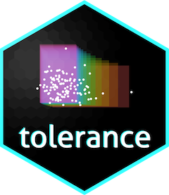

## tolerance: Statistical Tolerance Intervals and Regions	<a href='https://github.com/dsy109/tolerance'></a>

[](https://lifecycle.r-lib.org/articles/stages.html#stable)	
	
[](https://CRAN.R-project.org/package=tolerance)
[](https://cran.r-project.org/package=tolerance)

[](https://www.r-pkg.org/pkg/tolerance)
[](https://dx.doi.org/10.18637/jss.v036.i05)
[](https://doi.org/10.32614/RJ-2016-041)
[](https://doi.org/10.1016/B978-0-444-63431-3.00008-5)


### Synopsis

The [tolerance package](https://cran.r-project.org/package=tolerance) provides functions for estimating tolerance limits (intervals) for various univariate distributions, Bayesian normal tolerance limits, multivariate normal tolerance regions, nonparametric tolerance intervals, tolerance bands for regression settings, and analysis of variance tolerance intervals.  Visualizations in the form of histograms, scatterplots, and control charts are also available for many of these settings.    More details about the package are included in both the original [JSS](https://dx.doi.org/10.18637/jss.v036.i05) article as well as a subsequent [Handbook of Statistics](https://doi.org/10.1016/B978-0-444-63431-3.00008-5) book chapter.

Other highlights:

- Includes calculations for tolerance limits (intervals) for numerous continuous and discrete distributions.

- Pointwise tolerance interval calculations for linear, nonlinear, nonparametric, and multivariate regression settings are available.

- Functions for sample size determination in normal and nonparametric settings are available.

- Includes a novel operating characteristic curve function regarding _k_-factors for tolerance intervals based on normality.

- Novel nonparametric methods are included, such as the ability to construct multivariate hyperrectangular tolerance regions for setting reference regions.

### Documentation

The [JSS](https://dx.doi.org/10.18637/jss.v036.i05) article and the [Handbook of Statistics](https://doi.org/10.1016/B978-0-444-63431-3.00008-5) book chapter both provide documentation about the tolerance package.  The [RJ](https://doi.org/10.32614/RJ-2016-041) article provides an extensive overview of most of the normal-based procedures available within the tolerance package.  Moreover, the [help file](https://CRAN.R-project.org/package=tolerance) also documents the references used for each function.

### Examples

Additional examples for the tolerance package are currently being developed for a Shiny app.

### Installation

Released and tested versions of tolerance are available via the
[CRAN](https://cran.r-project.org) network, and can be installed from within R via

```R
install.packages("tolerance")
```

### Support

The [issue tickets at the GitHub repo](https://github.com/dsy109/tolerance/issues)
are the primary bug reporting interface.  As with the other web resources,
previous issues can be searched as well.

### Authors

Derek S. Young

### License

GPL (>= 2)

### Funding Acknowledgment

This package is based upon work supported by the Chan Zuckerberg Initiative, Grant Number [2020-225193](https://chanzuckerberg.com/eoss/proposals/enhancing-usability-of-mixtools-and-tolerance-for-the-biomedical-community/).

### Code of Conduct

As contributors and maintainers of this project, we pledge to respect all people who 
contribute through reporting issues, posting feature requests, updating documentation, 
submitting pull requests or patches, and other activities.  Both contributors and 
maintainers must consistently demonstrate acceptable behavior, respectful communications, 
and professional conduct.  Project maintainers have the right and responsibility to remove, 
edit, or reject comments, commits, code, wiki edits, issues, and other contributions that 
are not aligned to this Code of Conduct.  Project maintainers who do not follow the 
Code of Conduct may be removed from the project team.  Instances of abusive, harassing, 
or otherwise unacceptable behavior may be reported by opening an issue or contacting one 
or more of the project maintainers.  By contributing to this project, you agree to abide 
by its terms.

We are here for a love of coding and a passion for cultivating knowledge.  Let us enjoy 
this collaboration together!


